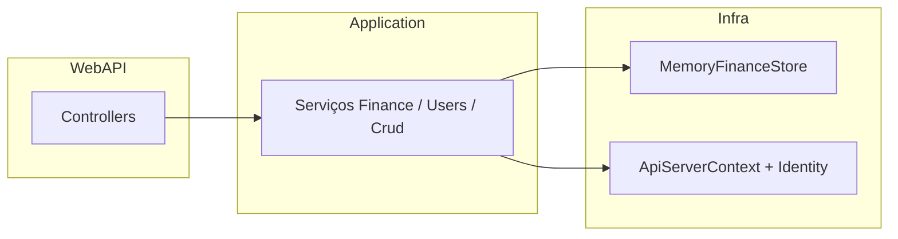

# Revisão da estrutura da API — registo de consulta

**Data do registo:** 12 de abril de 2026  
**Objetivo:** documento de referência para edições futuras de arquitetura e organização do código.

---

## Visão geral

A solução segue **camadas numeradas**, alinhada ao `README.md` na raiz de `API/`:

| Camada | Pasta | Responsabilidade |
|--------|--------|-------------------|
| **1 – Gateway** | `1 - Gateway/WebAPI` | ASP.NET Core: `Program.cs`, controllers, workers, migrações EF |
| **2 – Application** | `2 - Application/Application` + `Application.Dto` | Serviços (financeiro, CRUD, users), DTOs, AutoMapper |
| **3 – Domain** | `3 - Domain/Project` + `Notifications` | Entidades, perfis de mapeamento, notificações de validação |
| **4 – Infra** | `4 - Infra/Repositories` + `SqlServer` | `IFinanceStore`, `UnitOfWork`, `ApiServerContext`, Identity + JWT |

**Ponto de entrada:** `1 - Gateway/WebAPI/Program.cs` — Serilog (console), carregamento de segredos / `DATABASE_URL`, validação PostgreSQL, DbContext, aplicação de migrações ao arranque, CORS aberto, compressão, autenticação JWT e `RecurringExpenseWorker`.

---

## Pontos fortes

1. **Separação por camadas** clara: controllers finos delegam para serviços de aplicação.
2. **`BaseController`** centraliza `[Authorize]`, rota `api/[controller]`, `HandleResponse` com `INotificationHandler` e envelope `ApiResponse<T>`.
3. **Configuração de base** pensada para deploy: `DatabaseUrlConfigurationLoader`, `PostgresConnectionFileLoader`, `PostgreSqlConfigurationGuard`, SQLite só quando explicitamente ligado.
4. **Produção:** handler de exceções com CORS explícito (evita confundir 500 com “falha de CORS”); rota `/` com metadados do serviço.
5. **Domínio financeiro** coberto por serviços dedicados e interface `IFinanceStore`.

---

## Inconsistências e riscos (checklist para refactors)

### 1. Projeto `Framework` na solution em falta

O `API.sln` referencia `Framework\Framework.csproj`, mas o ficheiro pode não existir no disco — projeto “quebrado” na solution. **Ação possível:** remover da solution ou restaurar o projeto.

### 2. Nome `SqlServer` vs PostgreSQL / SQLite

O projeto de persistência chama-se **SqlServer**, mas o runtime usa **PostgreSQL** (Npgsql) ou **SQLite**. **Ação possível:** renomear projeto/pasta ou documentar claramente no README.

### 3. Duas fontes de verdade para dados

- **Utilizadores / Identity:** EF Core + PostgreSQL (ou SQLite).
- **Dados financeiros:** `IFinanceStore` → **`MemoryFinanceStore`** (memória no processo).

Os dados financeiros **não persistem** no Postgres com o desenho atual; reinício do serviço apaga esse estado. **Ação possível:** implementar `IFinanceStore` (ou repositórios) sobre EF no mesmo modelo/migrações.

### 4. `TempPublicUsersController`

Endpoints `[AllowAnonymous]` que listam / consultam utilizadores — **alto risco** se expostos em produção. Comentário no código: remover ou proteger. **Ação possível:** eliminar, ou `[Authorize(Roles = "Admin")]`, ou feature flag só em Development.

### 5. `BaseController.CurrentUser`

Uso de `.GetAwaiter().GetResult()` sobre chamada async — **anti-padrão** e risco teórico de deadlock. **Ação possível:** método async dedicado ou obter utilizador no pipeline (middleware/filter).

### 6. Logging sensível

`EnableSensitiveDataLogging()` em `AddSqlServerDbContext` para Npgsql/SQLite pode **logar parâmetros SQL** em produção. **Ação possível:** condicionar a `IsDevelopment()`.

### 7. Nome do ficheiro de DI da Application

`AplicationDependecyInjection.cs` — typos em `Aplication` / `Dependecy`. **Ação possível:** renomear (e atualizar namespace/classe se necessário) com cuidado nas referências.

### 8. README vs código

O README ainda menciona SQL Server e ênfase em CRUD admin; o produto atual é **finanças + Postgres/SQLite + JWT**. **Ação possível:** alinhar documentação.

---

## Fluxo resumido (pedido → dados)

---

## Comandos úteis (lembrança)

- Correr API: `dotnet run --project "1 - Gateway/WebAPI/WebAPI.csproj"`
- Nova migration: ver secção **Migrations** no `README.md` da API

---

## Nota final

A **estrutura em camadas está coerente**; prioridades típicas de evolução: persistência financeira alinhada com a BD, segurança dos endpoints públicos, solution limpa, logging seguro em produção e pequenos ajustes de async/nomenclatura.

*Atualizar este ficheiro quando decisões de arquitetura mudarem.*
